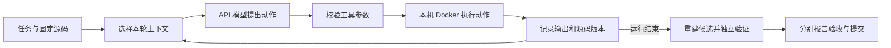

# 第五课：把项目讲清楚

你现在可以先这样理解 TracePatch：模型通过 API 提出“读哪里、改哪里、检查什么”，
项目把这些动作组织成可记录、可检查的过程，最后另外验证生成的补丁。
模型在 API 服务端运行，正式实验中的命令和检查在本机 Docker 执行。

## 一个任务怎样走完

mini-swe-agent 提供已有的 Agent 循环；TracePatch 添加上下文选择、证据记忆、工具接口、
预算和实验记录等能力。项目没有训练新的基础模型，也没有从零实现整个底座。

## 今天只掌握三个区别

**模型的决定与工具的执行。** 模型可以决定调用 `replace_text`，但真正查找原文、检查语法、
写入文件的是 Python 工具。模型参数正确而接口实现不兼容时，也会失败。
最近的真实案例正是 LF 参数与 CRLF 文件内容相同、换行字节不同。

**记住过与现在仍然有效。** 读到一段源码时，卡片保存其版本哈希。
源码修改后，旧卡片内容可能不再适用。项目将它标为 stale，重新读取后才恢复 current。
哈希标记的是字节是否一致，不说明内容是否正确，也不是学习到了新的模型知识。

**动作成功、检查成功与任务完成。** `applied` 表示编辑落盘；Python 退出码为零可能只是打印完了；
`Submitted` 表示模型按协议结束。独立验收另外运行，且验收本身也有覆盖范围，不能保证没有任何缺陷。

## 六个常见追问

| 问题 | 应能用自己的话回答 |
|---|---|
| 为什么不是只写一个提示词？ | 工具参数、实际文件版本、退出状态、预算和独立验证需要程序执行与记录，提示无法替代这些事实。 |
| 为什么不把全部历史都发给模型？ | 本项目限制输入请求字节数；保留任务和最近完整交互，必要时补回当前版本证据。字节额度不等于 token 窗口。 |
| 记忆模块提高了成功率吗？ | 目前只验证工程机制并做小规模开发对照，没有稳定提升证据，保留了所有负结果。 |
| 为什么独立测试不提前给模型？ | 将模型可见复现与最后验收分开，便于检查更广行为。题目来自公开历史问题，所以仍不能声称盲测或无训练污染。 |
| 修复换行问题证明了什么？ | 单元和 Docker 检查证明接口兼容处理有效；修订版尚未做新模型对照，不证明 Agent 更会修代码。 |
| 你本人做了什么？ | 按实际参与回答。代码由 AI 辅助开发；需求选择、设计判断、审计理解与能现场修改的部分，应分别说明，不能背稿冒充独立实现。 |

## 可参考的开场

“这是一个基于 mini-swe-agent 的 Coding Agent 执行诊断项目。我关注工具执行、上下文证据和评估之间的关系。
项目记录每一步源码变化，把模型提交与独立验收分开。在真实实验中，编辑工具两次找不到原文，
进一步核对发现函数内容正确，差异只有 CRLF/LF 换行。修复后通过单元和 Docker 回归，原模型失败结果仍保留。
目前它是一个小规模开发评估工具，没有稳定修复率提升或社区广泛采用的结论。”

这段描述说明项目事实；正式面试时根据自己真正理解和参与的范围调整主语。
现在先运行 [演示](DEMO.md)，找到 `replace_source`，把“模型给参数 → 工具修改 → 哈希变化 → 旧卡片失效”讲通即可。
