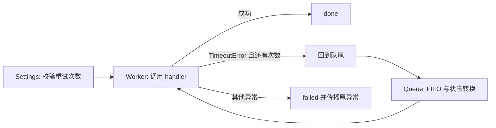

# 多文件开发任务：Job Queue

本任务是自建小型仓库，不是来自真实企业 issue，也不是独立标准基准。
其作用是检查 harness 能否导出、验证跨文件修复，并暴露更长任务中的执行问题。

## 三个模块的交互



测试覆盖配置、幂等入队、负载复制、队列公平性、合法状态转换、重试耗尽、最终成功和永久错误传播。
8 个测试方法包含多个边界场景，不能将这些断言当作 8 个独立修复任务来统计成功率。

## 验证协议

1. 在模型运行前冻结任务文件哈希、实现快照、模型、提示与预算。
2. 独立容器验证原始错误版本失败、参考修复通过。
3. 将参考修复中的三个模块分别替换为对应错误版本，要求三次验证全部失败，确认测试能识别各模块回归。
4. Agent 容器仅接收 workspace/，看不到参考修复或 verify.py。
5. 只导出任务清单允许的 config.py、queue_store.py、worker.py；独立验证使用原始 verify.py，不接收模型修改的测试。
6. 生成逐文件补丁、外部验证结果、完整本地轨迹；分别报告代码正确与正常提交。

模型端网络连接发生在主机适配器，任务容器无网络。当前隔离面向开发实验；不承诺抵御恶意参赛程序。
动作恢复策略仍仅处理不完整/格式错误回复，不能自动解决规划失误或所有业务逻辑错误。

## 运行

沿用 [环境配置](REPRODUCE.md)，然后从仓库根目录运行：

```powershell
.\.venv\Scripts\python.exe scripts/run-dev.py --suite multifile --batch dev-multi-check-local --verify-only
.\.venv\Scripts\python.exe scripts/run-dev.py --suite multifile --batch dev-multi-control-local --policy baseline
.\.venv\Scripts\python.exe scripts/run-dev.py --suite multifile --batch dev-multi-recovery-local --policy recovery
.\.venv\Scripts\python.exe scripts/compare-runs.py runs/dev-multi-control-local runs/dev-multi-recovery-local --output reports/multi-local.json
```

每题最多 12 次调用、每次最多 512 输出 Token，沿用总预算账本。此任务的模型步数和系统提示与单文件开发集不同，不能把两类任务当作同配置直接比较。

本地离线测试也包含任务参考版及三个单模块回归验证，无需 Docker 或 API。
